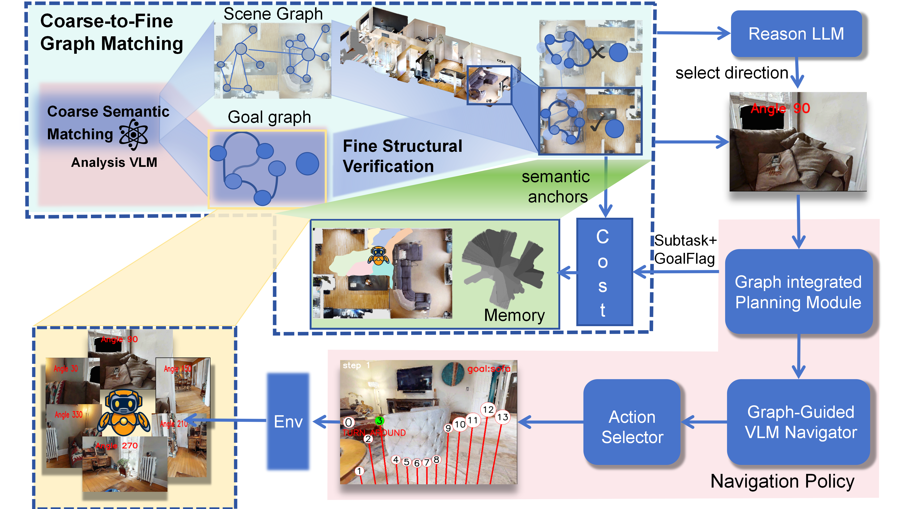

# HGWM: Hierarchical Graph-guided World Model for Zero-shot Object Navigation via Graph Matching

NeurIPS 2026 Submission

[arXiv](https://arxiv.org/) &nbsp;|&nbsp; [Project Page](https://github.com/itak04/HGWM) &nbsp;|&nbsp; [Paper PDF](./neurips_2026.tex)

Anonymous Author(s)

> This repository is the official implementation of **HGWM**, a zero-shot Object Goal Navigation framework that reframes navigation as **online graph matching** between an LLM-derived predictive prior and a persistent spatial-semantic graph memory.



HGWM is built on top of [WMNav](https://github.com/B0B8K1ng/WMNavigation) and [VLMnav](https://github.com/Jirl-upenn/VLMnav). Our method consists of four components:

- **Predictive prior** — an LLM hallucinates a hierarchical *Goal Subgraph* (rooms, anchor objects, connectivity priors) before any observation is taken.
- **Spatial-semantic graph memory** — observations are projected to world coordinates and stored as a persistent open-vocabulary 3D scene graph that survives field-of-view loss.
- **Coarse-to-fine graph matching** — a coarse VLM stage ranks frontier directions by goal-conditioned visual cues; a fine LLM stage performs structural pruning and weighted graph embedding against the goal prior.
- **Cognitive fusion policy** — an arbitrator switches between *Frontier Exploration → Focused Search → Target Verification* phases, blending the coarse and fine signals based on the overlap between $G_{goal}$ and $G_{scene}^{(t)}$.

## 🔥 News

- **May. 27th, 2026**: HGWM code release on GitHub.
- **May. 15th, 2026**: HGWM paper submitted to NeurIPS 2026.

## 📚 Table of Contents

- [Get Started](#-get-started)
  - [Installation and Setup](#-installation-and-setup)
  - [Prepare Dataset](#-prepare-dataset)
  - [API Keys](#-api-keys)
- [Demo](#-demo)
- [Evaluation](#-evaluation)
- [Customize Experiments](#-customize-experiments)
- [Results](#-results)
- [Acknowledgement](#-acknowledgement)
- [Citation](#-citation)

## 🚀 Get Started

### ⚙ Installation and Setup

Clone this repo.

```bash
git clone https://github.com/itak04/HGWM.git
cd HGWM
```

Create the conda environment and install all dependencies.

```bash
conda create -n hgwm python=3.9 cmake=3.14.0
conda activate hgwm
conda install habitat-sim=0.3.1 withbullet headless -c conda-forge -c aihabitat

pip install -r requirements.txt
```

### 🛢 Prepare Dataset

This project is based on the [Habitat simulator](https://github.com/facebookresearch/habitat-sim) and uses the [HM3D](https://aihabitat.org/datasets/hm3d/) and [MP3D](https://niessner.github.io/Matterport/) datasets. Our code requires all of the above data to live in a single `data` folder with the following layout. Place the downloaded HM3D v0.1, HM3D v0.2, and MP3D folders into the configuration below:

```
├── <DATASET_ROOT>
│  ├── hm3d_v0.1/
│  │  ├── val/
│  │  │  ├── 00800-TEEsavR23oF/
│  │  │  │  ├── TEEsavR23oF.navmesh
│  │  │  │  ├── TEEsavR23oF.glb
│  │  ├── hm3d_annotated_basis.scene_dataset_config.json
│  ├── objectnav_hm3d_v0.1/
│  │  ├── val/
│  │  │  ├── content/
│  │  │  │  ├── 4ok3usBNeis.json.gz
│  │  │  ├── val.json.gz
│  ├── hm3d_v0.2/
│  │  ├── val/
│  │  │  ├── 00800-TEEsavR23oF/
│  │  │  │  ├── TEEsavR23oF.basis.navmesh
│  │  │  │  ├── TEEsavR23oF.basis.glb
│  │  ├── hm3d_annotated_basis.scene_dataset_config.json
│  ├── objectnav_hm3d_v0.2/
│  │  ├── val/
│  │  │  ├── content/
│  │  │  │  ├── 4ok3usBNeis.json.gz
│  │  │  ├── val.json.gz
│  ├── mp3d/
│  │  ├── 17DRP5sb8fy/
│  │  │  ├── 17DRP5sb8fy.glb
│  │  │  ├── 17DRP5sb8fy.house
│  │  │  ├── 17DRP5sb8fy.navmesh
│  │  │  ├── 17DRP5sb8fy_semantic.ply
│  │  ├── mp3d_annotated_basis.scene_dataset_config.json
│  ├── objectnav_mp3d/
│  │  ├── val/
│  │  │  ├── content/
│  │  │  │  ├── 2azQ1b91cZZ.json.gz
│  │  │  ├── val.json.gz
```

Set `DATASET_ROOT` in your `.env` file (see `.env.example`).

Task datasets: `objectnav_hm3d_v0.1`, `objectnav_hm3d_v0.2` and `objectnav_mp3d`.

### 🚩 API Keys

HGWM uses **two foundation models**: a VLM for perception / coarse semantic scoring (default `Gemini-1.5-Pro`) and an LLM reasoner for goal-prior generation, structural pruning, and arbitration (default `Qwen2.5-7B-Instruct` via SiliconFlow).

Copy `.env.example` to `.env` and fill in your credentials:

```bash
cp .env.example .env
```

```
GEMINI_BASE_URL="https://generativelanguage.googleapis.com/v1beta/openai/"
GEMINI_API_KEY="YOUR_GEMINI_API_KEY"
SILICONFLOW_API_KEY="YOUR_SILICONFLOW_API_KEY"
DATASET_ROOT="/path/to/data"
LOG_DIR="/path/to/logs/"
```

You can swap the backbones in `config/HGWM.yaml`:

```yaml
agent_cfg:
  vlm_cfg:
    model_cls: GeminiVLM           # [GeminiVLM, QwenVLM, SiliconFlowVLM]
    model_kwargs:
      model: gemini-1.5-pro        # [gemini-1.5-flash, gemini-1.5-pro, gemini-2.0-flash, ...]
  llm_cfg:
    model_cls: SiliconFlowLLM
    model_kwargs:
      model: Pro/Qwen/Qwen2.5-7B-Instruct
```

**Self-hosted Qwen (optional).** To run the Qwen VLM locally with vLLM:

```bash
pip install 'vllm>0.7.2'
pip install qwen-vl-utils accelerate
vllm serve Qwen/Qwen2.5-VL-7B-Instruct \
  --port 8000 --host 0.0.0.0 --dtype bfloat16 \
  --limit-mm-per-prompt image=5,video=5
```

Then point the env to the local endpoint:

```
GEMINI_BASE_URL="http://localhost:8000/v1"
GEMINI_API_KEY="EMPTY"
```

Other VLM/LLM providers can be added by following the existing classes in `src/api.py`.

## 🎮 Demo

Visualize a single episode end-to-end:

```bash
python scripts/main.py --config HGWM
```

The agent will save the panoramic observations, the goal subgraph $G_{goal}$, the per-step scene graph $G_{scene}^{(t)}$, and the resulting trajectory under `logs/`.


## 📊 Evaluation

To evaluate HGWM at scale (HM3D v0.1: 2000 episodes, HM3D v0.2: 1000 episodes, MP3D: 2195 episodes) we use a tmux-based parallel evaluation harness. `parallel.sh` distributes `INSTANCES` workers over `GPU_LIST`, each running `NUM_EPISODES_PER_INSTANCE` episodes. A local Flask server aggregates results and uploads them to `wandb`.

```bash
# parallel.sh (key variables)
CFG="HGWM"                            # config name in config/${CFG}.yaml
DATASET="hm3d_v0.2"                   # [hm3d_v0.1, hm3d_v0.2, mp3d]
INSTANCES=10
NUM_EPISODES_PER_INSTANCE=20          # 20 for HM3D v0.2, 40 for HM3D v0.1, 44 for MP3D
MAX_STEPS_PER_EPISODE=40
GPU_LIST=(0)
VENV_NAME="hgwm"
```

Make sure `tmux` is installed and you are logged into `wandb`:

```bash
sudo apt install tmux         # Ubuntu/Debian
wandb login
bash parallel.sh
```

Each worker consumes ~320 MB of GPU memory. Per-step latency is dominated by VLM inference (~2.3 s for Gemini-1.5-Pro); the graph-memory update itself adds <25 ms per step.

Results are written under `logs/` and uploaded to your `wandb` project.

## 🔨 Customize Experiments

The main configuration lives in `config/HGWM.yaml`:

```yaml
task: ObjectNav
agent_cls: HGWMAgent          # agent class registered in src/hgwm_agent.py
env_cls: HGWMEnv              # env class registered in src/hgwm_env.py

agent_cfg:
  navigability_mode: 'depth_sensor'
  max_action_dist: 1.7
  min_action_dist: 0.5
  clip_frac: 0.66
  stopping_action_dist: 1.5
  default_action: 0.2

  hgwm_cfg:                   # coarse-to-fine graph matching
    max_qa_rounds: 3
    confidence_threshold: 0.7
    memory_decay_factor: 0.9
    use_scene_memory: true
    use_goal_subgraph: true
    enable_multi_stage_reasoning: true
    panoramic_analysis_mode: "directional_scoring"
```

The most relevant source files map directly onto the components in the paper:

| File | Role in the paper |
|------|--------------------|
| `src/hgwm_agent.py` | Main `HGWMAgent` — predict-perceive-ground loop, coarse-to-fine matching, cognitive arbitrator. |
| `src/hgwm_env.py`   | `HGWMEnv` — Habitat episode runner, metric logging, parallel aggregation. |
| `src/base_agent.py` | `VLMNavAgent` and the `WMNavAgent` baseline. |
| `src/scene_graph.py`| Spatial-semantic graph memory $M_{world}$ data structures. |
| `src/thought_parser.py` | Robust parsing of LLM/VLM JSON outputs for graph construction. |
| `src/api.py`        | VLM/LLM client wrappers (Gemini, SiliconFlow, Qwen). |
| `src/custom_agent.py`, `src/custom_env.py` | Ablation variants used in the component analysis. |

💡 To design your own model or rerun ablations, subclass `HGWMAgent` (or `VLMNavAgent`) in `src/custom_agent.py` and point `agent_cls`/`env_cls` in a new YAML at your class.

## 📈 Results

Main results on HM3D v0.1 and MP3D (zero-shot, unsupervised; see `neurips_2026.tex`):

| Method | Vision | Language | HM3D v0.1 SR↑ | HM3D v0.1 SPL↑ | MP3D SR↑ | MP3D SPL↑ |
|--------|--------|----------|---------------|----------------|----------|-----------|
| ESC          | -                 | GPT-3.5         | 39.2 | 22.3 | 28.7 | 14.2 |
| L3MVN        | -                 | GPT-2           | 50.4 | 23.1 |  -   |  -   |
| SG-Nav       | LLaVA-1.6-7B      | GPT-4           | 54.0 | 24.9 | 40.2 | 16.0 |
| UniGoal      | LLaVA-1.6-7B      | LLaMA-2-7B      | 54.5 | 25.1 | 41.0 | 16.4 |
| WMNav        | Gemini-1.5-Pro    | -               | 58.1 | 31.2 | 45.4 | 17.2 |
| **HGWM (Ours)** | **Gemini-1.5-Pro** | **Qwen2.5-7B-Instruct** | **62.6** | **31.5** | **46.8** | **17.9** |

Component analysis on HM3D v0.2 (paper Table 3):

| Variant | Memory | Decision signal | SR↑ | SPL↑ |
|---------|--------|------------------|-----|------|
| Basic VLM Nav            | None                          | Direct VLM scoring        | 67.8 | 29.3 |
| VLM + Voxel Memory       | Voxel memory                  | Direct VLM scoring        | 70.9 | 32.8 |
| **HGWM (Ours)**          | Hierarchical graph memory     | Coarse-to-fine matching   | **74.4** | 31.9 |

## 🙇 Acknowledgement

This work builds on many excellent open-source projects — thanks to all the authors for sharing:

- [WMNav](https://github.com/B0B8K1ng/WMNavigation)
- [VLMnav](https://github.com/Jirl-upenn/VLMnav)
- [Pixel-Navigator](https://github.com/wzcai99/Pixel-Navigator)
- [habitat-lab](https://github.com/facebookresearch/habitat-lab) / [habitat-sim](https://github.com/facebookresearch/habitat-sim)
- [Matterport3D](https://niessner.github.io/Matterport/)

## 📑 Citation

If you find HGWM useful in your research, please cite our paper:

```bibtex
@inproceedings{hgwm2026,
  title     = {HGWM: Hierarchical Graph-guided World Model for Zero-shot Object Navigation via Graph Matching},
  author    = {Anonymous Author(s)},
  booktitle = {Advances in Neural Information Processing Systems (NeurIPS)},
  year      = {2026}
}
```
